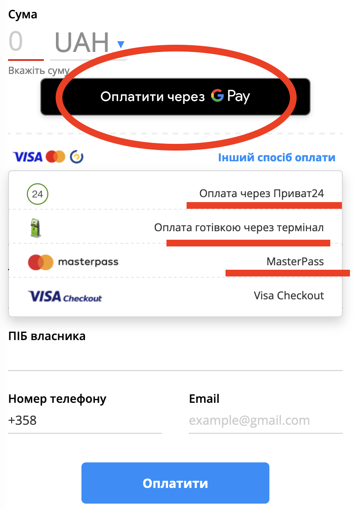

## Task 1

### Requirement: 
   Refactor method `beforeEach` in class `TestRunner`.
   
1. Allow running test in different browser.
2. Avoid reading from .env file before each test.

## Task 2

### Requirement: 
Create wrapper for WebDriver. Make changes to `DriverWrapper` class.

## Task 3

### Requirement:
Create pages via PageFactory using DriverWrapper.

1. Create pages HomePage, HelpUsPage, ClubsPage, ChallengePage, NewsPage, AboutUsPage, UkrainianServicesPage.
   In HomePage create methods to go to the corresponding pages. 

## Task 4 

### Requirement: 
Check the availability to pay via different payment method. Prepare a test script.
   Make changes to the `HelpUsTest` class.
1. Go to the HelpUsPage clicking on `Допомогти проекту` at the bottom of the page.
2. Check the presence of elements 
   

## Task 5 (additional, optional)

### Requirement:
Check correctness of select and multiple select in bootstrap. Make changes to `DriverWrapper` and `BootstrapFormControlsPage` classes.
1. Create method for handle select dropdown in `DriverWrapper` class.
2. Go to the https://getbootstrap.com/docs/4.0/components/forms/#form-controls.
3. Check the correctness of elements
   

> Record a short video (3-5 minutes) demonstrating your code functionality and test execution, then post it on your YouTube channel.
The report should include a link to GitHub and a link to the video.
